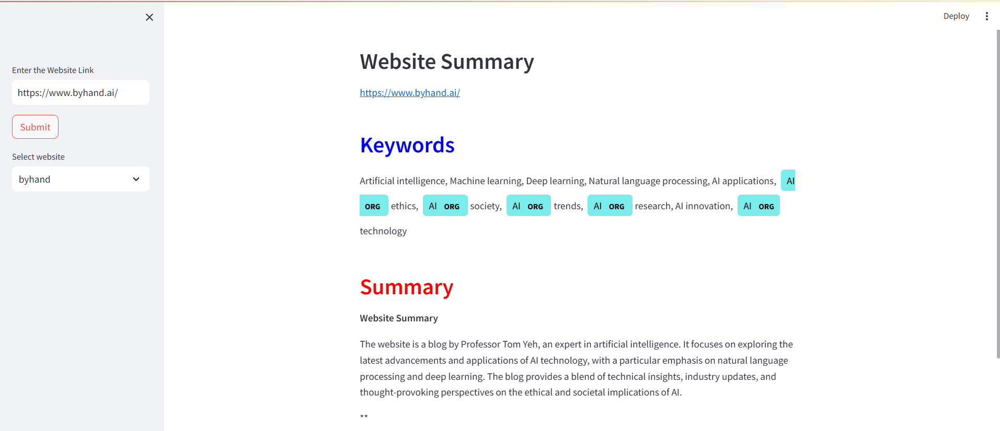

# Website Summary and Keyword Generator App

This is a **Streamlit-based web application** that allows users to enter a URL and receive a **descriptive summary** and **keywords** extracted from the website's content. The app uses **Google Gemini AI** for generating the summary and keywords, **SpaCy** for Natural Language Processing (NLP), and **Selenium** to extract visible text from web pages.

## Features
- **Extracts visible text from a website**: The app scrapes the website's content using Selenium.
- **Generates a descriptive summary**: The summary of the website is generated using the **Google Gemini AI** model.
- **Keyword generation**: Keywords relevant to the website's content are extracted and displayed.
- **NLP visualization**: Keywords are visualized using **SpaCy**'s Named Entity Recognition (NER) visualizer.

## Prerequisites

Make sure you have the following installed:

- Python 3.8 or above
- Streamlit
- Selenium
- SpaCy
- BeautifulSoup
- Google Generative AI SDK

You can install the necessary dependencies using `pip`:

```bash
pip install streamlit selenium spacy beautifulsoup4 google generativeai requests pandas
```
## Additionally, install the SpaCy model:

```bash
python -m spacy download en_core_web_sm
```
How to Run Locally

Clone the repository:
```bash
git clone https://github.com/pankaj7322/website-summary-using-gemini-model
cd website-summary-using-gemini-model
```
## Install the dependencies mentioned in the prerequisites section.

## Run the Streamlit app:
```bash
streamlit run web_summary.py
```
The app will be available in your browser at http://localhost:8501.

## How It Works

**URL Input:**
The user enters a URL into the sidebar input field.

**Data Extraction:**
Selenium is used to navigate to the website and extract the visible text.

**Generative AI Model:**
The visible text is passed to the Google Gemini AI model to generate a descriptive summary and a list of keywords.

**NLP Visualization:**
SpaCy is used to tokenize and analyze the generated keywords, which are then visualized in a Named Entity Recognition (NER) style.

**Result Display:**
The summary and keywords are displayed on the webpage. The keywords are also visualized for a better understanding of their relationships.

**Code Overview**
web_summary.py

## This is the main script that powers the app:
```bash
selection_box(url): Adds the website URL to a session dictionary for easy reference.
extract_website_data(url): Uses Selenium to scrape the visible text from the website.
printing_summary(response_new, url): Processes the generated AI response and displays the summary and visualizations.
generativeai_model(prompt, visible_text): Communicates with Google Gemini AI to generate a descriptive summary and keywords based on the website content.
extract_name(url): Extracts the website's name from the URL to store in session state.
main(): The main entry point for Streamlit, which handles user interaction and rendering of results.
    
```

## Deployment

**To deploy the app on Streamlit Cloud or any cloud-based service:**

    Push your code to a GitHub repository.
    Link the repository to Streamlit Cloud.
    Deploy and share the URL for access.

**Troubleshooting**

    If you're facing issues with Selenium or ChromeDriver in cloud environments (like Streamlit Cloud), consider using Playwright as an alternative browser automation tool.
    If your app is crashing or not generating results, make sure your Google Gemini AI API key is correctly configured in the script.

**License**

This project is licensed under the MIT License - see the LICENSE file for details.


